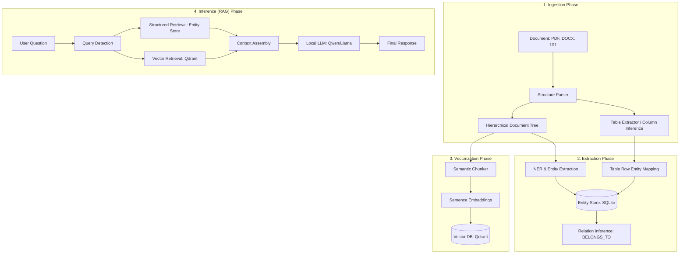

# Universal Ingestion Pipeline & Local RAG

A professional-grade, local-only document ingestion and retrieval-augmented generation (RAG) pipeline. Designed to extract high-fidelity structure, entities, and relations from complex documents while maintaining 100% data privacy.

---

## 🏗️ Architecture & Control Flow

The pipeline follows a sophisticated multi-stage process to transform raw unstructured documents into a structured knowledge base and interactive agent.



---

## 🚀 Key Features

*   **Hierarchical Structure Parsing**: Preserves document sections, headers, and paragraphs using a parent-child `DocumentTree` model.
*   **Robust Table Extraction**: Proprietary x-coordinate clustering for automatic column inference and header detection, converting complex tables into queryable entities.
*   **Local-Only NER**: Domain-agnostic Named Entity Recognition for codes, persons, organizations, dates, and amounts without external API calls.
*   **Context-Aware Retrieval**: Smart "Scope" propagation (e.g., "Semester IV" context) that filters structured entities based on the query's detected intent.
*   **Multi-Format Support**: Native support for PDF (layout-aware), DOCX (style-aware), TXT, and Markdown.

---

## 📊 Benchmarking & Performance

The pipeline includes a specialized `benchmark.py` module to measure latency across all stages of the RAG lifecycle.

| Metric | Description | Targeted Optimization |
|:---|:---|:---|
| **Embed Latency** | Time to vectorize the query | CPU batch execution via `all-MiniLM-L6-v2` |
| **Search Latency** | Qdrant lookup speed | Indexed vector search |
| **TTFT** | Time to First Token from LLM | Prompt pre-fill and KV-cache management |
| **Throughput** | Token generation speed (Tokens/sec) | 4-bit/6-bit GGUF quantization efficiency |
| **Pipeline Total** | End-to-end user wait time | Streaming responses for immediate feedback |

---

## 🛠️ Setup & Local Models

To ensure high performance and privacy, this project uses local models for both embeddings and inference.

### 📁 Required Folders
In the project root, create the following directories to store your models:
```bash
mkdir models        # For LLM (GGUF) files
mkdir embed_models  # For sentence-transformer models
```

### 📥 Suggested Models
1.  **LLM**: [Qwen2.5-3B-Instruct (GGUF)](https://huggingface.co/Qwen/Qwen2.5-3B-Instruct-GGUF) - Excellent balance of logic and speed.
2.  **Embedding**: [all-MiniLM-L6-v2](https://huggingface.co/sentence-transformers/all-MiniLM-L6-v2) - Industry standard for fast local retrieval.

### ⚠️ Note on Path Configuration
> [!IMPORTANT]
> By default, some modules in this codebase reference models located in `~/ai/models` and `~/ai/embed_models`. Since only this directory will be pushed to Git, you should:
> 1.  Update the `model_path` in `infer.py` and `model_name` in `embed.py` to point to the relative `./models` and `./embed_models` folders.
> 2.  Alternatively, ensure your local environment mimics the expected directory structure or use Environment Variables for dynamic path resolution.

---

## 💻 Usage

### 1. Ingest Documents
Process and store document contents into the Vector DB and Entity Store.
```bash
python add_to_db.py data/your_document.pdf --collection my_docs
```

### 2. High-Fidelity Inference
Query the RAG pipeline with entity-aware retrieval.
```bash
python infer.py "What are the requirements for semester 2?" --rag
```

### 3. Run Performance Benchmark
Verify your hardware's performance metrics.
```bash
python benchmark.py "Explain the attendance system" --rag --runs 3
```

---

## 📂 Project Structure

*   **/structure**: Core parsing logic, segmenters, and the Entity Store implementation.
*   **/extraction**: NER and Relation extraction pipelines.
*   **/data**: Local storage for source documents.
*   **add_to_db.py**: Main ingestion entry point.
*   **infer.py**: Main RAG and LLM interaction module.
*   **benchmark.py**: Latency and throughput testing utility.

  ## Example inference
  

